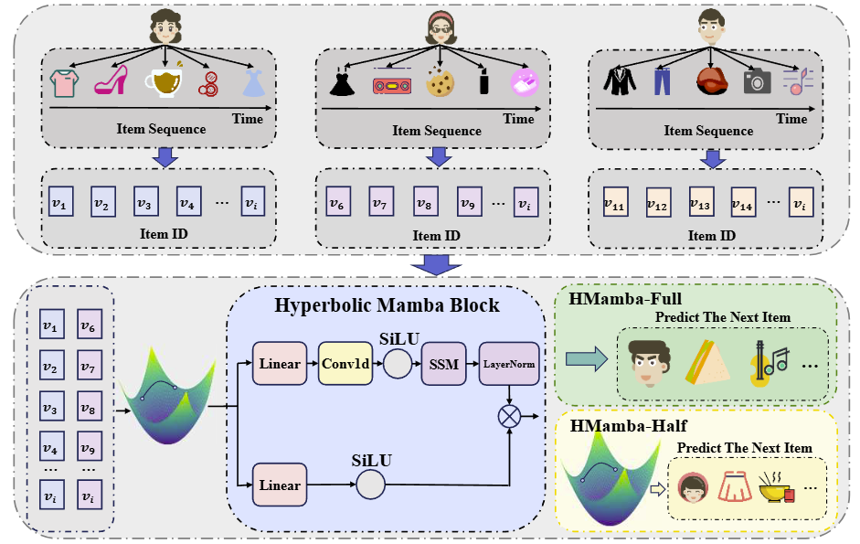
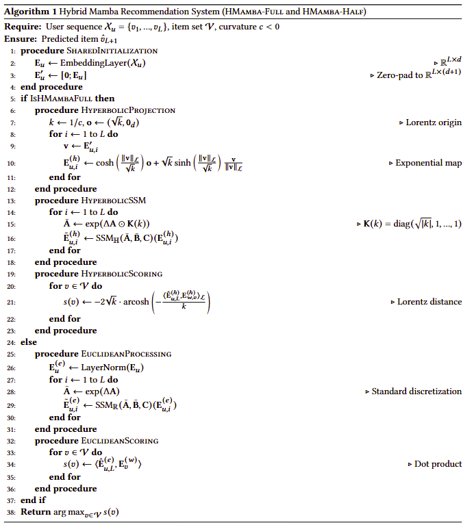

# HMamba: Hyperbolic Mamba for Sequential Recommendation
Sequential recommendation systems require both temporal efficiency to handle long interaction histories and hierarchical representation to model complex user-item relationships. Existing approaches face a fundamental tension: Mamba-based methods offer linear-time efficiency $\mathcal{O}(L)$ but operate in Euclidean space, which distorts hierarchical patterns; hyperbolic models capture taxonomies well but suffer quadratic complexity $\mathcal{O}(L^2)$. To solve this dual challenge, we propose Hyperbolic Mamba (HMamba), the first architecture that unifies curvature-aware state spaces with hyperbolic geometry. Our key insight is that hyperbolic curvature $\kappa$ simultaneously governs: (1) state transition granularity through $\mathbf{\bar{A}} = \exp(\Delta\mathbf{A} \odot \mathbf{K}(\kappa))$ and (2) hierarchical distance preservation via $d_{\mathcal{L}} \propto \sqrt{\kappa} \log(\cdot)$. This enables joint optimization of efficiency and hierarchy - addressing the previously unsolved problem of deep-long modeling. Experiments show HMamba achieves 3-11% accuracy gains while maintaining 3.2 × faster training than attention-based models, establishing a new paradigm for hierarchy-aware sequential recommendation

## Model Architecture


## Algorithm


## Usage

### Requirements

* Python: 3.8.10
* PyTorch: 2.0.0+cu118
* CUDA 11.8
* Install RecBole:
  * `pip install recbole`
* Install causal Conv1d and the core Mamba package:
  * `pip install causal-conv1d>=1.2.0`
  * `pip install mamba-ssm`

### Run

```python run.py```
